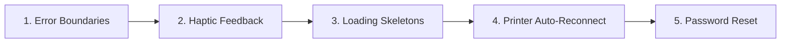

# Phase 2: Robustness & UX — Implementation Plan

> **Scope:** 5 remaining items from the Phase 2 roadmap. Network status awareness + offline support is already complete.

---

## Status Matrix

| # | Feature | Status | Effort |
|---|---------|--------|--------|
| 1 | Error boundaries | ❌ Not started | Small |
| 2 | Network status awareness | ✅ **Done** | — |
| 3 | Printer auto-reconnect | ❌ Not started | Medium |
| 4 | Password reset flow | ❌ Not started | Medium |
| 5 | Loading skeletons | ❌ Not started | Medium |
| 6 | Haptic feedback | ❌ Not started | Small |

---

## 1. Error Boundaries

**Goal:** Catch JS crashes gracefully instead of white-screening.

### Changes

#### [NEW] `components/error-boundary.tsx`
- React class component with `componentDidCatch` + `getDerivedStateFromError`
- Renders fallback UI: error icon + "Something went wrong" + Retry button
- `onRetry` resets error state and re-renders children

#### [MODIFY] `app/_layout.tsx`
- Wrap `<Stack>` with `<ErrorBoundary>` to catch any screen crash

> [!NOTE]
> React Native doesn't support `react-error-boundary` (DOM-only). Must use class component.

---

## 2. Printer Auto-Reconnect

**Goal:** Persist last-connected printer and auto-reconnect on app start.

### Changes

#### [MODIFY] `store/printer.ts`
- Add `lastDeviceId: string | null` and `lastDeviceName: string | null` to store state
- On successful `connect()`: save device ID + name to AsyncStorage (`billsnapr-last-printer`)
- On `disconnect()`: clear AsyncStorage entry
- Add `tryAutoReconnect()` action:
  - Reads saved device from AsyncStorage
  - Attempts `RNBluetoothClassic.connectToDevice(savedId)`
  - Silent failure (no alert) — sets `connectedDevice` if successful

#### [MODIFY] `app/(tabs)/_layout.tsx` or `app/_layout.tsx`
- Call `usePrinterStore.getState().tryAutoReconnect()` on app mount (inside a `useEffect`)
- Only attempt if Bluetooth is enabled and permissions are granted

> [!IMPORTANT]
> Auto-reconnect must be silent — no alerts if printer isn't nearby. Only show success toast.

---

## 3. Password Reset Flow

**Goal:** Let users reset their password via email.

### Changes

#### [NEW] `app/(auth)/forgot-password.tsx`
- Email input + "Send Reset Link" button
- Calls `supabase.auth.resetPasswordForEmail(email)`
- Shows success message: "Check your email for reset instructions"

#### [NEW] `hooks/use-auth.ts` — add `useResetPassword` hook
- Wraps `supabase.auth.resetPasswordForEmail()` in `useMutation`

#### [MODIFY] `app/(auth)/login.tsx`
- Add "Forgot password?" link below the password field
- Links to `/(auth)/forgot-password`

#### [MODIFY] `app/(auth)/_layout.tsx`
- Add `forgot-password` screen to the auth stack

> [!NOTE]
> Supabase handles the reset email + token validation. The app just needs to send the request. A deep-link to handle the reset token in-app is optional (Phase 4 polish).

---

## 4. Loading Skeletons

**Goal:** Replace `<ActivityIndicator>` with content-shape placeholders for a premium feel.

### Changes

#### [NEW] `components/ui/skeleton.tsx`
- Animated shimmer component using `react-native-reanimated`
- Configurable `width`, `height`, `borderRadius`
- Shimmer effect: gradient animation left-to-right

#### [NEW] `components/skeletons/product-skeleton.tsx`
- Grid of product card placeholders (image box + text lines)
- Matches `<ProductCard>` dimensions

#### [NEW] `components/skeletons/order-skeleton.tsx`
- List of order row placeholders (icon + text + amount)

#### [MODIFY] Screens using `<ActivityIndicator>` as loading state
Files to update (replace spinner with skeleton):
- `app/(tabs)/index.tsx` — POS product grid
- `app/(tabs)/orders.tsx` — order list
- `app/(tabs)/dashboard.tsx` — stats cards
- `app/(tabs)/products.tsx` — product management list

> [!TIP]
> Auth screens (login, register) keep `<ActivityIndicator>` on buttons — those are action loaders, not content loaders. Only replace page-level loading states.

---

## 5. Haptic Feedback

**Goal:** Tactile feedback on key interactions using `expo-haptics`.

### Changes

#### [NEW] `lib/haptics.ts`
- Utility wrapping `expo-haptics` for consistent usage:
  - `hapticLight()` — light impact (add to cart, toggle)
  - `hapticMedium()` — medium impact (checkout, delete)
  - `hapticSuccess()` — notification success (order placed)
  - `hapticError()` — notification error (validation fail)
- Silently no-ops on Android < 8 or if haptics unavailable

#### [MODIFY] Add haptic calls to:
| Screen | Action | Type |
|--------|--------|------|
| `app/(tabs)/index.tsx` | Add to cart | Light |
| `app/checkout.tsx` | Payment method select | Light |
| `app/checkout.tsx` | Place order (success) | Success |
| `app/checkout.tsx` | Place order (error) | Error |
| `app/(tabs)/orders.tsx` | Void order | Medium |
| `app/modal-product.tsx` | Save product | Light |
| `app/modal-category.tsx` | Save category | Light |

---

## Implementation Order

**Rationale:** Start with small, independent items (error boundaries, haptics) → medium items with UI work (skeletons) → features requiring end-to-end testing (printer, auth).

---

## Verification Plan

### After Each Feature
- Manual test on Android device
- Verify no regressions in existing flows

### Full Phase 2 Checklist
- [ ] Error boundary catches a thrown error → shows fallback UI → retry works
- [ ] Haptic feedback fires on all listed interactions
- [ ] Skeleton loaders show while data loads, then transition to content
- [ ] Printer auto-reconnects silently on app restart if printer is on
- [ ] "Forgot password" sends reset email → user receives it
